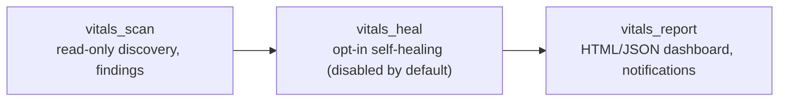

# LinuxVitals

Agentless Ansible collection for Linux fleet health checks across RHEL, Fedora, Ubuntu, and SUSE. LinuxVitals performs deep OS posture checks, attempts one-shot self-healing for failed enabled services (opt-in), and renders a consolidated, self-contained HTML dashboard plus a JSON report for downstream automation -- with Slack, email, and generic webhook summaries for operations teams.

Collection: `sameeralam3127.linux_vitals`

## What This Does

- CPU and platform-aware system discovery through Ansible facts
- Memory usage monitoring with warning and critical thresholds
- Journal and error scanning for recent failures
- Running service validation for `sssd`, `systemd-journald`, and `chronyd` or `ntp`
- Network-aware host inventory with hostname and IP address reporting
- Kernel, reboot, boot-space, rescue image, security-control, and login-failure checks
- Opt-in one-shot self-healing for failed enabled services
- Pre-maintenance baseline / post-maintenance comparison workflow, correlated by a maintenance id
- Consolidated, self-contained HTML dashboard (health score, search/filter/sort, expandable host detail, before/after comparison) and JSON report generation with optional archive retention
- Slack, email, and generic webhook notifications for run summaries

## Documentation

- [Installation](docs/installation.md)
- [Quick Start](docs/quickstart.md)
- [Configuration Reference](docs/configuration-reference.md)
- [Variable Reference](docs/variable-reference.md)
- [Report Guide](docs/report-guide.md) -- dashboard tour, JSON schema, findings reference
- [Examples](docs/examples.md)
- [Troubleshooting](docs/troubleshooting.md)
- [Architecture](docs/architecture.md)
- [Contributing](CONTRIBUTING.md)
- [Changelog](CHANGELOG.md)

## Architecture

LinuxVitals is a small pipeline of three composable roles, sharing one `linux_vitals_*` variable namespace so they can be run together (via `playbooks/healthcheck.yml`) or independently in your own playbooks:



- **`vitals_scan`** -- gathers facts, logs, kernel/boot/security posture, and builds a per-host findings + `final_status` result. Read-only.
- **`vitals_heal`** -- attempts one restart per systemd-enabled failed service. Disabled by default (`linux_vitals_heal_enabled: false`); nothing on managed hosts changes unless you opt in.
- **`vitals_report`** -- loads notification config, renders the consolidated HTML/JSON dashboard, archives historical reports, and sends Slack/email/generic-webhook summaries.

## Repo Layout

```text
.
├── galaxy.yml
├── meta/runtime.yml
├── playbooks/
│   ├── healthcheck.yml       # one-shot, standalone
│   ├── baseline.yml          # pre-maintenance snapshot
│   └── postcheck.yml         # post-maintenance snapshot + comparison
├── roles/
│   ├── vitals_scan/
│   ├── vitals_heal/
│   └── vitals_report/
├── examples/
│   ├── inventory/
│   └── group_vars/
├── docs/
├── tests/
├── CONTRIBUTING.md
└── CHANGELOG.md
```

## Requirements

- Python 3.10+
- Ansible Core 2.16+
- Linux targets using `systemd`
- SSH access from the Ansible control node to each managed host
- Privilege escalation rights for checks that need `become`

## Installation

Once published, install from Ansible Galaxy:

```bash
ansible-galaxy collection install sameeralam3127.linux_vitals
```

For local development, symlink this repo into a repo-local dev collections root so it resolves as `sameeralam3127.linux_vitals` (this path is already wired into `ansible.cfg`'s `collections_path`, and is gitignored):

```bash
mkdir -p .dev-collections/ansible_collections/sameeralam3127
ln -s "$(pwd)" .dev-collections/ansible_collections/sameeralam3127/linux_vitals
```

## Quick Start

```bash
python3 -m venv .venv
source .venv/bin/activate
pip install -r requirements-dev.txt
ansible-galaxy collection install -r requirements.yml

cp examples/inventory/hosts.example.ini inventory.ini   # edit hosts for your fleet
cp .env.example .env                                    # only if you plan to enable notifications

ansible-playbook -i inventory.ini playbooks/healthcheck.yml --syntax-check
pytest -q
ansible-playbook -i inventory.ini playbooks/healthcheck.yml
```

Once installed as a collection, run it without cloning this repo:

```bash
ansible-playbook -i inventory.ini sameeralam3127.linux_vitals.healthcheck
```

`.env` and report output are resolved relative to your **inventory directory** (`inventory_dir`), not the collection's own install path -- so both the dev workflow and the installed-collection workflow read/write files in your project, never inside the installed package.

## Inventory Example

See [examples/inventory/hosts.example.ini](examples/inventory/hosts.example.ini):

```ini
[linux_servers]
rhel01 ansible_host=192.0.2.10
ubuntu01 ansible_host=192.0.2.11
fedora01 ansible_host=192.0.2.12
sles01 ansible_host=192.0.2.13

[linux_servers:vars]
ansible_user=automation
ansible_become=true
```

## Configuration

Role defaults are conservative and can be overridden in inventory, `group_vars`, or extra vars. See [examples/group_vars/all.yml.example](examples/group_vars/all.yml.example) for a copy-paste starting point.

`vitals_scan` (thresholds, log windows) -- [roles/vitals_scan/defaults/main.yml](roles/vitals_scan/defaults/main.yml):

```yaml
linux_vitals_log_window: "30 minutes ago"
linux_vitals_audit_log_window: "7 days ago"
linux_vitals_ram_warning_threshold: 80
linux_vitals_ram_critical_threshold: 95
linux_vitals_boot_warning_threshold: 20
```

`vitals_heal` (opt-in self-healing) -- [roles/vitals_heal/defaults/main.yml](roles/vitals_heal/defaults/main.yml):

```yaml
linux_vitals_heal_enabled: false
```

`vitals_report` (maintenance workflow, output, archiving, notifications) -- [roles/vitals_report/defaults/main.yml](roles/vitals_report/defaults/main.yml):

```yaml
linux_vitals_phase: "adhoc"  # or "baseline" / "postcheck", set by the matching playbook
linux_vitals_maintenance_id: ""  # required for baseline/postcheck, pass with -e
linux_vitals_snapshot_dir: "{{ inventory_dir }}/reports/snapshots"

linux_vitals_output_path: "{{ inventory_dir }}/reports/linux_vitals_report.html"
linux_vitals_archive_html_reports: true
linux_vitals_archive_json_reports: false
linux_vitals_json_output_path: "{{ inventory_dir }}/reports/linux_vitals_report.json"
linux_vitals_report_archive_dir: "{{ linux_vitals_output_path | dirname }}/archive"
linux_vitals_report_retention_count: 10
linux_vitals_report_title: "LinuxVitals Health Check Dashboard"
linux_vitals_slack_webhook_url: ""
linux_vitals_slack_message_header: "Standard Maintenance Summary"
linux_vitals_slack_include_host_breakdown: true
linux_vitals_email_enabled: false
linux_vitals_email_to: []
linux_vitals_generic_webhook_enabled: false
linux_vitals_generic_webhook_url: ""
```

## Notification Examples

Slack through `.env` (placed next to your inventory):

```dotenv
SLACK_WEBHOOK_URL="https://hooks.slack.com/services/your/team/webhook"
```

Generic webhook through `.env`:

```dotenv
GENERIC_WEBHOOK_URL="https://example.com/health-events"
```

Email through `group_vars/all.yml` plus `.env` SMTP secrets:

```yaml
linux_vitals_email_enabled: true
linux_vitals_email_to:
  - "ops@example.com"
linux_vitals_email_port: 587
linux_vitals_email_secure: "starttls"
```

```dotenv
EMAIL_SMTP_HOST="smtp.example.com"
EMAIL_SMTP_USERNAME="smtp-user"
EMAIL_SMTP_PASSWORD="smtp-password"
```

Resolution order for every channel is the same: an explicit inventory/`group_vars`/extra-vars value wins; otherwise the matching `.env` value is used; otherwise the channel is skipped. You can enable more than one channel at once.

## Self-Healing (Opt-In)

`vitals_heal` runs every time the playbook does, but its tasks are skipped unless `linux_vitals_heal_enabled: true` is set. With it enabled, LinuxVitals attempts exactly one restart per systemd-enabled service found in a `failed` state, then re-checks the required-service status (`sssd`, `systemd-journald`, time sync) so the dashboard reflects the post-restart state.

## Maintenance Workflow: Baseline / Postcheck Comparison

Run before and after a maintenance window with the same maintenance id to get an automatic before/after comparison in the dashboard:

```bash
# Before maintenance
ansible-playbook -i inventory.ini sameeralam3127.linux_vitals.baseline \
  -e linux_vitals_maintenance_id=2026-07-12-patch-window

# ... do your maintenance ...

# After maintenance, same id
ansible-playbook -i inventory.ini sameeralam3127.linux_vitals.postcheck \
  -e linux_vitals_maintenance_id=2026-07-12-patch-window
```

The postcheck dashboard adds a "Change" column, Regressed/Improved/New-hosts filter chips, and a per-host before/after panel (status, RAM delta, kernel change, reboot-required change, new/resolved findings). Hosts with no matching baseline snapshot (e.g. newly added servers) are marked "New" rather than failing the run. Full details in [docs/report-guide.md](docs/report-guide.md) and [docs/quickstart.md](docs/quickstart.md).

## Usage

```bash
ansible-playbook -i inventory.ini playbooks/healthcheck.yml
```

Targeted slices with tags:

```bash
# Discovery facts, service state, memory, logs, kernel, boot, and security posture
ansible-playbook -i inventory.ini playbooks/healthcheck.yml --tags discovery

# Kernel and reboot-required checks
ansible-playbook -i inventory.ini playbooks/healthcheck.yml --tags kernel

# SELinux, AppArmor, and failed-login checks
ansible-playbook -i inventory.ini playbooks/healthcheck.yml --tags security

# Boot partition and rescue image checks
ansible-playbook -i inventory.ini playbooks/healthcheck.yml --tags boot

# Self-healing restart attempts (only acts if linux_vitals_heal_enabled: true)
ansible-playbook -i inventory.ini playbooks/healthcheck.yml --tags self_healing

# Rebuild report artifacts and send configured notifications from current run data
ansible-playbook -i inventory.ini playbooks/healthcheck.yml --tags reporting,notifications
```

## Validation

```bash
pre-commit install
pre-commit run --all-files
ANSIBLE_LOCAL_TEMP=.ansible/tmp ANSIBLE_REMOTE_TEMP=.ansible/tmp ansible-lint roles/ playbooks/
ansible-playbook playbooks/healthcheck.yml --syntax-check
pytest -q
```

A GitHub Actions workflow at [.github/workflows/ci.yml](.github/workflows/ci.yml) runs the same checks on pushes and pull requests.

## Troubleshooting

See [docs/troubleshooting.md](docs/troubleshooting.md) for the full list. Quick pointers:

- If `reports/` is missing, run the playbook once; report files are generated next to your inventory and ignored by git.
- If tagged runs skip expected output, include `reporting` with your focused tags, for example `--tags discovery,kernel,reporting`.
- If `ansible-playbook sameeralam3127.linux_vitals.healthcheck` can't find the collection, confirm it's installed (`ansible-galaxy collection list | grep linux_vitals`) or symlinked for local dev (see [docs/installation.md](docs/installation.md)).

## Contributing

See [CONTRIBUTING.md](CONTRIBUTING.md) for the development setup, test suite, and Galaxy publishing process.

## License

MIT
