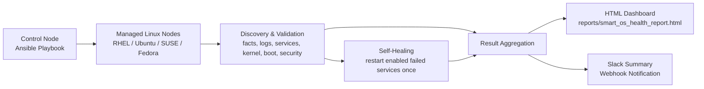

# Smart OS Health Check & Self-Healing

Enterprise-focused Ansible automation for Linux VM fleets running RHEL, Fedora, Ubuntu, and SUSE. This project performs smart OS health checks, captures deeper system posture, attempts one-shot self-healing for failed enabled services, generates an HTML dashboard, and sends a Slack summary for operations teams.

## What This Does

Automated OS health checks using Ansible:

- CPU and platform-aware system discovery through Ansible facts
- Memory usage monitoring with warning and critical thresholds
- Journal and error scanning for recent failures
- Running service validation for `sssd`, `systemd-journald`, and `chronyd` or `ntp`
- Network-aware host inventory with hostname and IP address reporting
- Kernel, reboot, boot-space, rescue image, security-control, and login-failure checks

## Features

- Agentless Linux health checks across RHEL, Fedora, Ubuntu, and SUSE
- Lightweight role-based design with modular task files
- Customizable thresholds using inventory, `group_vars`, or `.env`
- One-shot self-healing for failed enabled services
- HTML dashboard export for management-friendly reporting
- Slack webhook summaries for operational visibility
- Detailed host-level findings including:
  - uptime
  - VM vs physical classification
  - running kernel vs latest installed kernel
  - default boot entry vs latest installed kernel
  - reboot required state
  - SELinux and AppArmor status
  - boot partition health
  - rescue image availability
  - failed login attempts
  - kernel install or bootloader related failures

## Why This Repo Stands Out

Many Ansible health-check projects stop at basic CPU, memory, and disk metrics. This one goes further by combining:

- deep OS posture checks
- self-healing for enabled failed services
- HTML dashboard output
- Slack reporting

That makes it closer to an SRE-style operational health framework than a simple check script.

## Architecture



## Repo Structure

Main playbook:

```text
smart_os_health_check.yml
```

Role:

```text
roles/smart_os_health_check
```

Modular task layout:

- [config.yml](/Users/sameeralam/Documents/GitHub/ansible-server-health-dashboard/roles/smart_os_health_check/tasks/config.yml)
- [discovery.yml](/Users/sameeralam/Documents/GitHub/ansible-server-health-dashboard/roles/smart_os_health_check/tasks/discovery.yml)
- [self_healing.yml](/Users/sameeralam/Documents/GitHub/ansible-server-health-dashboard/roles/smart_os_health_check/tasks/self_healing.yml)
- [result.yml](/Users/sameeralam/Documents/GitHub/ansible-server-health-dashboard/roles/smart_os_health_check/tasks/result.yml)
- [reporting.yml](/Users/sameeralam/Documents/GitHub/ansible-server-health-dashboard/roles/smart_os_health_check/tasks/reporting.yml)

## Requirements

- Python 3.10+
- Ansible Core 2.16+
- Linux targets using `systemd`

Install local tooling:

```bash
pip install ansible-core ansible-lint pre-commit
```

## Inventory Example

Edit [inventory/hosts.ini](/Users/sameeralam/Documents/GitHub/ansible-server-health-dashboard/inventory/hosts.ini):

```ini
[linux_servers]
rhel01 ansible_host=192.168.1.10
ubuntu01 ansible_host=192.168.1.11
fedora01 ansible_host=192.168.1.12
sles01 ansible_host=192.168.1.13

[linux_servers:vars]
ansible_user=automation
ansible_become=true
```

## Configuration

You can override these defaults in inventory, `group_vars`, or extra vars:

```yaml
smart_os_health_check_output_path: "{{ playbook_dir }}/reports/smart_os_health_report.html"
smart_os_health_check_log_window: "30 minutes ago"
smart_os_health_check_audit_log_window: "7 days ago"
smart_os_health_check_ram_warning_threshold: 80
smart_os_health_check_ram_critical_threshold: 95
smart_os_health_check_boot_warning_threshold: 20
smart_os_health_check_slack_webhook_url: "https://hooks.slack.com/services/your/team/webhook"
smart_os_health_check_slack_message_header: "Standard Maintenance Summary"
smart_os_health_check_slack_message_footer: "Generated by Ansible"
smart_os_health_check_slack_include_host_breakdown: true
```

Shared overrides for all hosts can be placed in [group_vars/all.yml](/Users/sameeralam/Documents/GitHub/ansible-server-health-dashboard/group_vars/all.yml).

## Slack Webhook via `.env`

Create a local `.env` file from [.env.example](/Users/sameeralam/Documents/GitHub/ansible-server-health-dashboard/.env.example):

```bash
cp .env.example .env
```

Add your webhook:

```bash
SLACK_WEBHOOK_URL="https://hooks.slack.com/services/your/team/webhook"
```

Slack resolution order:

- `group_vars` / inventory / extra vars value in `smart_os_health_check_slack_webhook_url`
- `.env` value from `SLACK_WEBHOOK_URL`
- if neither is set, the Slack task is skipped

## Usage

Run the playbook:

```bash
ansible-playbook -i inventory/hosts.ini smart_os_health_check.yml
```

Validate before running:

```bash
ANSIBLE_LOCAL_TEMP=/tmp/ansible-local ANSIBLE_REMOTE_TEMP=/tmp/ansible-remote ansible-lint smart_os_health_check.yml
ansible-playbook -i inventory/hosts.ini smart_os_health_check.yml --syntax-check
```

## Sample Output

Generated HTML dashboard:

```text
reports/smart_os_health_report.html
```

Current sample report file in this repo:

[smart_os_health_report.html](/Users/sameeralam/Documents/GitHub/ansible-server-health-dashboard/reports/smart_os_health_report.html)

Sample Slack output:

```text
Standard Maintenance Summary
Overall Status: FAIL
Servers Checked: 2 | Auto-Fixed: 0 | Critical Errors: 2
Summary: 2 Servers Checked, 0 Auto-Fixed, 2 Critical Errors
Host Breakdown:
- server1 (192.168.2.19) | Status: Pass | Type: Virtual Machine | Uptime: 12d 4h 21m | Kernel: 5.14.0-503.35.1.el9_5.x86_64 | Reboot: No | Boot: Healthy | Failed Logins: 0
- server2 (192.168.2.20) | Status: Fail | Type: Physical | Uptime: 48d 7h 13m | Kernel: 6.8.0-60-generic (latest installed not active) | Reboot: Required | Boot: Low | Failed Logins: 3
Generated by Ansible
```

## Reporting

HTML dashboard summary table includes:

- Hostname
- IP Address
- OS
- RAM Status
- Log Errors
- Services Healed
- Final Status

Extended host detail cards include:

- Uptime and last reboot
- VM or physical platform classification
- Running kernel vs latest installed kernel
- Default boot entry validation when GRUB data is available
- Reboot required state
- SELinux and AppArmor status
- Boot partition status and free space
- Rescue image availability
- Last failed login attempt
- Kernel install failure excerpts

## GitHub Topics

Recommended repository topics:

- `ansible`
- `devops`
- `monitoring`
- `health-check`
- `sre`
- `automation`
- `linux`

## Quality Checks

Install hooks:

```bash
pre-commit install
```

Run validation:

```bash
pre-commit run --all-files
ANSIBLE_LOCAL_TEMP=/tmp/ansible-local ANSIBLE_REMOTE_TEMP=/tmp/ansible-remote ansible-lint smart_os_health_check.yml
ansible-playbook -i inventory/hosts.ini smart_os_health_check.yml --syntax-check
```

## License

MIT
