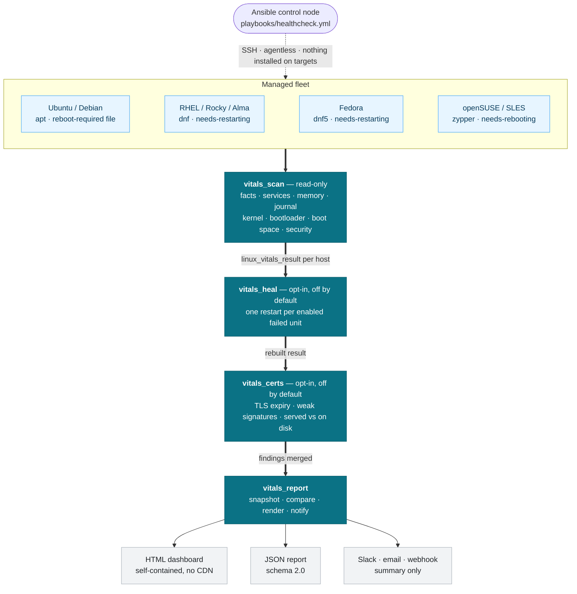

# LinuxVitals

[](https://github.com/sameeralam3127/linux-vitals/actions/workflows/ci.yml)
[](https://galaxy.ansible.com/ui/repo/published/sameeralam3127/linux_vitals/)
[](LICENSE)
[](docs/testing.md)

**Agentless health checks for a mixed Linux fleet.** Scan every host over SSH,
get one self-contained HTML dashboard and a JSON report, and optionally let it
restart what it can fix.

Nothing is installed on managed hosts. Every check is read-only unless you
explicitly opt in to remediation.

Collection: `sameeralam3127.linux_vitals` · [Browse a sample dashboard](https://sameeralam3127.github.io/linux-vitals/) · [Ansible Galaxy](https://galaxy.ansible.com/ui/repo/published/sameeralam3127/linux_vitals/)

---

## The dashboard


Three consecutive runs against the same fleet — healthy, broken, then healed.
Watch the columns that move: **Boot Space** `Healthy` → `Low`, **Reboot**
`No` → `Required`, **Auto-Fixed** `0` → `3`. Every frame is a real run.

One HTML file per run. No CDN, no external requests, no server to host it —
open it from a laptop or attach it to a change ticket. Search, filter, and sort
the fleet; expand any host for its findings, kernel and bootloader state, boot
space, and self-healing outcome.

| Expanded host detail | Baseline vs. postcheck |
| --- | --- |
| [](docs/images/dashboard-host-detail.png) | [](docs/images/dashboard-comparison.png) |

Full tour, JSON schema, and every finding it can raise: **[Report Guide](docs/report-guide.md)**.

---

## Try it in 60 seconds — no fleet required

Spins up Ubuntu, Rocky, and Fedora containers, breaks them on purpose, and
shows LinuxVitals detecting and remediating the damage:

```bash
git clone https://github.com/sameeralam3127/linux-vitals
cd linux-vitals/demo && ./run.sh
```

You end up with three dashboards to compare — healthy, broken, healed — covering
failed services, a required reboot, boot-space pressure, journal errors, and a
memory threshold breach. Needs only Docker and `ansible-core`.
`./run.sh clean` removes every trace of it.

> **[demo/README.md](demo/README.md)** has the per-fault tags, and an honest
> account of which faults are genuinely induced and which are staged.

---

## Run it against your own fleet

### 1. Install

```bash
ansible-galaxy collection install sameeralam3127.linux_vitals
```

That pulls `community.general` too, which the notification tasks need.

### 2. Point it at your hosts

Create `inventory.ini` — the shipped playbooks all target a group called
`linux_servers`:

```ini
[linux_servers]
rhel01   ansible_host=192.0.2.10
ubuntu01 ansible_host=192.0.2.11

[linux_servers:vars]
ansible_user=automation
ansible_become=true
```

A fuller starting point, with key paths and a mixed fleet, is in
[examples/inventory/hosts.example.ini](examples/inventory/hosts.example.ini).

### 3. Run

```bash
ansible-playbook -i inventory.ini sameeralam3127.linux_vitals.healthcheck
```

### 4. Open the report

```
reports/linux_vitals_report.html
```

**Reports land next to your inventory**, not inside the installed collection.
Every path — reports, snapshots, and the optional `.env` — resolves from your
inventory directory, so the same command works whether you installed from
Galaxy or cloned this repo.

That is the whole loop. Everything below is optional.

---

## What it checks

| Area | Checks |
| --- | --- |
| **System** | CPU and platform discovery, virtualization type, uptime, last reboot, asset serial |
| **Memory** | Usage against warning and critical thresholds |
| **Services** | `sssd`, `systemd-journald`, and the resolved time-sync unit |
| **Logs** | Journal errors in a configurable window, plus kernel/bootloader failures |
| **Kernel & boot** | Running vs. latest installed kernel, bootloader default entry, reboot-required (per distro), `/boot` free space, rescue image |
| **Security** | SELinux, AppArmor, recent failed logins |
| **TLS** *(opt-in)* | Certificate expiry, weak signatures, obsolete TLS versions, served-vs-on-disk mismatches |

Every finding carries a **severity**, and each host rolls up to the worst one it
has. Results render as an HTML dashboard and a JSON report, with optional
Slack, email, and generic-webhook summaries.

---

## Severity: what makes a host "Fail"

Findings are classified `info`, `warning`, or `critical`:

| Severity | Meaning |
| --- | --- |
| `critical` | Something is broken now, or you are blind to it |
| `warning` | Something will break, or a control you rely on is off |
| `info` | Worth seeing, too noisy to page on |

**By default a host fails on *any* finding**, which is how every release before
severity existed behaved. Raise the threshold to turn severity into triage —
every finding is still reported, but only ones at or above the threshold count
against the host:

```yaml
linux_vitals_fail_on_severity: critical   # default: info
```

Retune individual findings rather than replacing the whole map, so findings
added in a later release keep a sensible default:

```yaml
linux_vitals_finding_severity_overrides:
  apparmor_disabled: info       # we do not run AppArmor
  reboot_required: critical     # our change window is tight
```

Because `final_status` drives the fleet health score, raising the threshold
raises the score. The full finding reference — id, severity, and trigger for
every check — is in the [Report Guide](docs/report-guide.md#findings), and what
to *do* about each one is in the [Operator Runbook](docs/runbook.md).

---

## Configuration

Defaults are conservative and safe. The four most people change:

```yaml
linux_vitals_ram_critical_threshold: 95   # RAM % that fails a host
linux_vitals_fail_on_severity: info       # severity that fails a host
linux_vitals_heal_enabled: false          # opt in to service restarts
linux_vitals_certs_enabled: false         # opt in to TLS checks
```

Set them in `group_vars`, inventory, or with `-e`.

**[Variable Reference](docs/variable-reference.md)** documents all 50 variables
with defaults and descriptions —
[examples/group_vars/all.yml.example](examples/group_vars/all.yml.example) is a
copy-paste starting point with every one of them commented out.

### Notifications

Put secrets in a `.env` next to your inventory (see [.env.example](.env.example)):

```dotenv
SLACK_WEBHOOK_URL="https://hooks.slack.com/services/your/team/webhook"
GENERIC_WEBHOOK_URL="https://example.com/health-events"
EMAIL_SMTP_HOST="smtp.example.com"
EMAIL_SMTP_USERNAME="smtp-user"
EMAIL_SMTP_PASSWORD="smtp-password"
```

Email also needs enabling and addressing:

```yaml
linux_vitals_email_enabled: true
linux_vitals_email_to: ["ops@example.com"]
```

Resolution order is the same for every channel: an explicit
inventory/`group_vars`/extra-vars value wins, otherwise the matching `.env`
value, otherwise the channel is skipped. More than one can be active at once,
and credentials never reach a managed host or a report.

---

## Self-healing (opt-in)

```yaml
linux_vitals_heal_enabled: true
```

Off by default — nothing on a managed host changes until you set this. With it
on, LinuxVitals attempts **exactly one restart** per service that is both
**enabled at boot** and **in a failed state**, then re-checks the required
services so the dashboard reflects the post-restart result.

There is no allowlist: it restarts whatever is enabled and failed. Enable it
per group rather than globally, and see
[Enabling self-healing safely](docs/runbook.md#procedure-enabling-self-healing-safely)
for the one command that shows what it *would* restart before you switch it on.

---

## TLS certificate checks (opt-in)

```yaml
linux_vitals_certs_enabled: true
linux_vitals_cert_warning_days: 30
linux_vitals_cert_critical_days: 7

# Optional. Connections are made *from each managed host*, so `localhost`
# means the certificate that host itself serves. Empty by default — enabling
# the role connects to nothing until you name a target.
linux_vitals_cert_endpoints:
  - host: localhost
    port: 443
    server_name: www.example.com
```

Reports expiry, weak signature algorithms, self-signed served certificates,
obsolete negotiated TLS versions, and certificates being served that match
nothing on disk — usually a service that was never reloaded after renewal.

Certificates are parsed with `openssl` and the handshake uses the Python
standard library, so **nothing new is installed on managed hosts**. The system
CA trust store is scanned but only reported when a certificate has already
expired, so hundreds of root certificates that are not yours do not bury the
findings that are.

> Read [the threat model](docs/threat-model.md#vitals_certs-the-only-role-that-opens-a-connection)
> before enabling endpoint checks. This is the only role that opens outbound
> connections, and reading `/etc/letsencrypt/live` needs `become`.

---

## Maintenance windows: before/after comparison

Run the same maintenance id before and after a change window to get an
automatic comparison:

```bash
MAINT_ID="$(date +%Y-%m-%d)-patch-window"

ansible-playbook -i inventory.ini sameeralam3127.linux_vitals.baseline \
  -e linux_vitals_maintenance_id="$MAINT_ID"

# ... do your maintenance ...

ansible-playbook -i inventory.ini sameeralam3127.linux_vitals.postcheck \
  -e linux_vitals_maintenance_id="$MAINT_ID"
```

The postcheck dashboard gains Regressed / Improved / New filters and a per-host
before/after panel. Hosts with no matching baseline are marked **New** rather
than failing the run. Step-by-step:
[Running a maintenance window](docs/runbook.md#procedure-a-maintenance-window).

---

## Running part of a check

Every task is tagged, so you can run a slice instead of the whole scan:

| Tag | Runs |
| --- | --- |
| `discovery` | Facts, services, memory, logs, kernel, boot, security |
| `kernel` | Kernel and reboot-required checks |
| `security` | SELinux, AppArmor, failed logins |
| `boot` | Boot partition and rescue image |
| `self_healing` | Restart attempts (only acts if enabled) |
| `certs` | TLS certificate checks (only acts if enabled) |
| `reporting`, `notifications` | Rebuild reports and send summaries |

```bash
ansible-playbook -i inventory.ini playbooks/healthcheck.yml --tags kernel,reporting
```

> Include `reporting` with any focused tag, or the run produces no output file.

---

## Architecture

Four composable roles sharing one `linux_vitals_*` namespace — run them
together via `playbooks/healthcheck.yml`, or individually in your own playbook:


```mermaid
flowchart TB
    CN(["Ansible control node<br/>playbooks/healthcheck.yml"])

    CN -. "SSH · agentless · nothing installed on targets" .-> FLEET

    subgraph FLEET["Managed fleet"]
        direction LR
        U["Ubuntu / Debian<br/>apt · reboot-required file"]
        R["RHEL / Rocky / Alma<br/>dnf · needs-restarting"]
        F["Fedora<br/>dnf5 · needs-restarting"]
        S["openSUSE / SLES<br/>zypper · needs-rebooting"]
        U ~~~ R ~~~ F ~~~ S
    end

    FLEET ==> SCAN

    SCAN["<b>vitals_scan</b> — read-only<br/>facts · services · memory · journal<br/>kernel · bootloader · boot space · security"]
    HEAL["<b>vitals_heal</b> — opt-in, off by default<br/>one restart per enabled failed unit"]
    CERTS["<b>vitals_certs</b> — opt-in, off by default<br/>TLS expiry · weak signatures · served vs on disk"]
    REPORT["<b>vitals_report</b><br/>snapshot · compare · render · notify"]

    SCAN ==>|"linux_vitals_result per host"| HEAL
    HEAL ==>|"rebuilt result"| CERTS
    CERTS ==>|"findings merged"| REPORT

    REPORT --> HTML["HTML dashboard<br/>self-contained, no CDN"]
    REPORT --> JSON["JSON report<br/>schema 2.0"]
    REPORT --> NOTIFY["Slack · email · webhook<br/>summary only"]

    classDef stage fill:#0b7285,stroke:#095c6b,color:#ffffff
    classDef out fill:#f1f3f5,stroke:#adb5bd,color:#212529
    classDef host fill:#e7f5ff,stroke:#4dabf7,color:#0b3d5c
    class SCAN,HEAL,CERTS,REPORT stage
    class HTML,JSON,NOTIFY out
    class U,R,F,S host
```

Why the roles share one variable namespace, and why paths resolve from
`inventory_dir`: [Architecture](docs/architecture.md).

### Consuming the JSON

`reports/linux_vitals_report.json` is **schema 2.0**. Findings are objects
(`{id, message, severity}`), not strings, and each carries a stable `id` you can
join on — `message` wording may change between releases, ids will not.

---

## Requirements

| | |
| --- | --- |
| **Control node** | Python 3.10+, `ansible-core` 2.16+, and the `community.general` collection |
| **Managed hosts** | Linux with `systemd`. Nothing installed — no agent, no Python packages beyond what Ansible itself needs |
| **Access** | SSH from the control node, plus `become` for the checks that read privileged state |

`become` is never set by the collection — it is entirely your decision, made in
inventory. The scan needs to *read* privileged state, not write, so a narrow
sudoers rule is enough for everything except self-healing:
[what `become` actually needs](docs/threat-model.md#become----what-actually-needs-it).

---

## Documentation

**Getting started**
- [Installation](docs/installation.md) · [Quick Start](docs/quickstart.md) · [Examples](docs/examples.md)
- [Demo Environment](demo/README.md) — a three-distro fleet you can break on purpose

**Using it day to day**
- [Operator Runbook](docs/runbook.md) — what to do when a finding fires, per finding
- [Report Guide](docs/report-guide.md) — dashboard tour, JSON schema, finding reference
- [Troubleshooting](docs/troubleshooting.md) — when the tool itself misbehaves

**Reference**
- [Variable Reference](docs/variable-reference.md) · [Configuration Reference](docs/configuration-reference.md)
- [Kernel & Reboot Detection](docs/kernel-reboot-detection.md) — per-distro logic and known edge cases
- [Architecture](docs/architecture.md) · [Performance & Scale](docs/performance.md)

**Security**
- [Security Policy](.github/SECURITY.md) — what to report privately, and how
- [Threat Model](docs/threat-model.md) — `become`, self-healing limits, credentials, what lands in a report

**Project**
- [Roadmap](docs/roadmap.md) · [Changelog](CHANGELOG.md) · [Contributing](.github/CONTRIBUTING.md) · [Testing](docs/testing.md)

---

## Developing

Clone, then symlink the repo so FQCN roles resolve (already wired into
`ansible.cfg`, and gitignored):

```bash
mkdir -p .dev-collections/ansible_collections/sameeralam3127
ln -s "$(pwd)" .dev-collections/ansible_collections/sameeralam3127/linux_vitals

python3 -m venv .venv && source .venv/bin/activate
pip install -r requirements-dev.txt
ansible-galaxy collection install -r requirements.yml
```

Checks, matching what CI runs on every push and pull request
([ci.yml](.github/workflows/ci.yml)):

```bash
pre-commit install
pre-commit run --all-files
ANSIBLE_LOCAL_TEMP=.ansible/tmp ANSIBLE_REMOTE_TEMP=.ansible/tmp \
  ansible-lint roles/ playbooks/ molecule/ demo/
ansible-playbook playbooks/healthcheck.yml --syntax-check
pytest -q
```

CI additionally runs the per-distro Molecule scenarios (Ubuntu, Rocky, Fedora,
openSUSE) — see [Testing](docs/testing.md) to run those locally.

---

## Contributing

Setup, test suite, and the Galaxy publishing process: [CONTRIBUTING.md](.github/CONTRIBUTING.md).
Found a security issue? Please report it privately — [SECURITY.md](.github/SECURITY.md).

## License

MIT — see [LICENSE](LICENSE).
