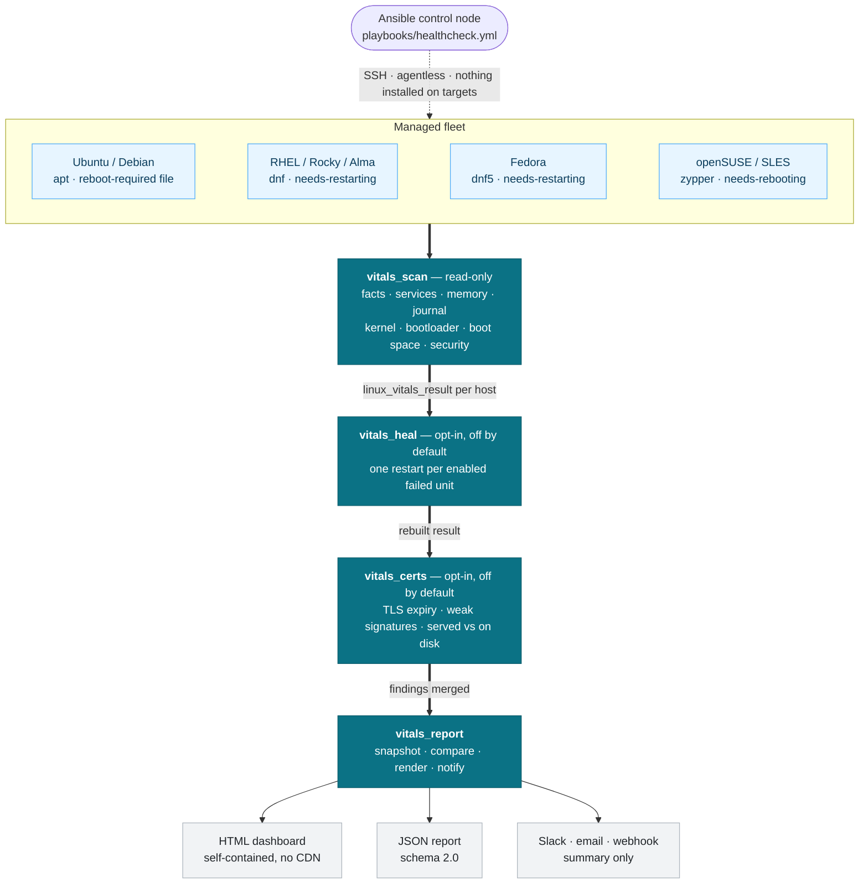

# Architecture

## Why four roles, one variable namespace

LinuxVitals is a single logical pipeline -- scan a host, optionally heal it,
optionally check its certificates, report on the fleet -- split into four
roles so each stage can be reused,
disabled, or run independently:



- **`vitals_scan`** gathers facts, journal/log posture, kernel and bootloader
  state, boot-partition health, security controls, and failed-login data,
  then builds one `linux_vitals_result` fact per host with a `final_status`
  (`Pass`/`Fail`) and a list of `findings`. It never changes anything on the
  managed host.
- **`vitals_heal`** is entirely gated by `linux_vitals_heal_enabled`
  (default `false`). When enabled, it attempts exactly one restart per
  systemd-enabled service found in a `failed` state, then re-checks the
  required-service status and rebuilds `vitals_scan`'s `linux_vitals_result`
  so the report reflects the post-restart state -- the result object is built
  before this role runs, so without that rebuild the healing outcomes would
  never reach the dashboard.
  When disabled, its tasks are skipped but its role defaults still load, so
  `linux_vitals_heal_enabled` is always defined regardless of whether the
  role is present in a given play.
- **`vitals_certs`** is gated by `linux_vitals_certs_enabled`
  (default `false`) and is the only role that opens an outbound network
  connection: it checks TLS certificate expiry, weak signature algorithms,
  and whether what a host *serves* matches what is on its disk. It appends
  its findings to the host result `vitals_scan` already built, then
  re-includes `vitals_scan`'s `tasks/severity.yml` to recompute the host
  severity and `final_status` over the combined list -- sharing that file
  rather than reimplementing it is what keeps the two roles from drifting on
  what "critical" means. What it connects to, and why that is a trust
  boundary the other roles do not cross, is in
  [threat-model.md](threat-model.md#vitals_certs-the-only-role-that-opens-a-connection).
- **`vitals_report`** loads notification config (`.env` + inventory
  overrides), persists baseline/postcheck snapshots, computes the
  before/after comparison, renders the HTML dashboard and JSON report,
  archives historical reports, and sends Slack/email/generic-webhook
  summaries.

Unlike a typical Ansible Galaxy role, these four are deliberately **not**
independent -- they share one `linux_vitals_*` variable and fact namespace
instead of each having its own prefix (`vitals_scan_*`, `vitals_heal_*`,
...). That's a conscious tradeoff, not an oversight: `vitals_heal` needs to
read and overwrite fields `vitals_scan` produced (`healing_results`,
`services_healed`), `vitals_certs` appends to the same `findings` list and
recomputes the `final_status` built from it, and `vitals_report` needs to
read the full `linux_vitals_result` object as-is. A per-role prefix would
require a translation/mapping layer between every stage for no real benefit, since
the roles are always meant to be composed together (as
`playbooks/healthcheck.yml`, `baseline.yml`, and `postcheck.yml` all do).
`.ansible-lint` explicitly skips `var-naming[no-role-prefix]` for this
reason.

If you're consuming just `vitals_scan` in your own playbook (for example,
to build a different reporting pipeline), be aware that its
`linux_vitals_result` fact assumes `vitals_heal` either ran first or its
defaults are loaded -- `linux_vitals_healing_results` and
`linux_vitals_services_healed` are read with `| default([])` specifically
so `vitals_scan` stays safe to run standalone.

## Security boundaries

The trust boundaries this pipeline crosses -- managed host to control node,
control node to managed host, and control node to Slack/SMTP -- are documented
in [threat-model.md](threat-model.md), along with what each stage is permitted
to modify.

## Data flow

1. `vitals_scan` sets `linux_vitals_result` (a per-host fact) with a fixed
   schema: identity, kernel/bootloader, security, boot space, memory, logs,
   self-healing summary, `asset_serial`, `final_status`, `findings`, and a
   default `comparison: {baseline_available: false}` placeholder.
2. `vitals_heal`, if enabled, updates the self-healing-related facts that
   feed back into that same `linux_vitals_result` (rebuilt by `vitals_scan`
   in `tasks/result.yml`, which runs after `vitals_heal` in every shipped
   playbook).
3. `vitals_certs`, if enabled, runs after that rebuild and appends its own
   findings to `linux_vitals_result.findings`, then recomputes
   `final_status` and the host severity over the merged list by including
   `vitals_scan/tasks/severity.yml`. It is last in the scanning half for a
   reason: it is the only stage that can block on the network, so anything
   that must run regardless of a slow or unreachable TLS endpoint runs
   before it.
4. `vitals_report`:
   - `config.yml` resolves notification secrets/URLs from inventory,
     `group_vars`, extra vars, or a local `.env` (highest to lowest
     precedence in that order).
   - `snapshot.yml` persists `linux_vitals_result` as JSON under
     `linux_vitals_snapshot_dir/<maintenance_id>/<phase>/<host>.json` when
     `linux_vitals_phase` is `baseline` or `postcheck`.
   - `compare.yml`, only in the `postcheck` phase, loads the matching
     baseline snapshot per host and merges a `comparison` object into
     `linux_vitals_result`. Findings are matched on `(id, subject)`, and a
     baseline written by 1.x -- plain-string findings -- is translated to
     ids first, so a window spanning the upgrade still compares correctly.
   - `render.yml` aggregates all per-host results (delegated to
     `localhost`, `run_once`) into `linux_vitals_summary`, then renders
     `dashboard.html.j2` and `report.json.j2`, and manages archive
     retention.
   - `notify.yml` sends the same summary through whichever channels are
     configured.

Today collection and evaluation both happen inside step 1: `discovery.yml`
gathers raw state and also decides several statuses from it (RAM, boot space,
kernel selection, AppArmor, bootloader match, reboot fallback). The raw state
on its own is specified as a separate, independently versioned document,
`state_schema: 1`, in [state-schema.md](state-schema.md). Nothing emits it
yet; it is the contract the collection/evaluation split
([#98](https://github.com/sameeralam3127/linux-vitals/issues/98)) builds
against. What step 1 produces for a given state is pinned by the golden-file
tests described in [testing.md](testing.md#golden-file-tests).

## The finding object, and what it cannot yet say

Every check that has something to report appends a finding. Since
[#8](https://github.com/sameeralam3127/linux-vitals/issues/8) the shape is:

```json
{ "id": "boot_space_low", "message": "...", "severity": "warning" }
```

The `id` is the stable join key -- the runbook, the severity map
(`linux_vitals_finding_severities`), operator overrides
(`linux_vitals_finding_severity_overrides`), and any future export all key off
it, which is why rewording a `message` is a safe change and renaming an `id`
is not. Severity is resolved in one place, `vitals_scan/tasks/severity.yml`,
which `vitals_certs` includes rather than reimplements.

The known limitation: **a finding exists only when something is wrong, and
`final_status` is `Pass` or `Fail` with nothing in between.** There is no way
to record that a check could not run. A command that fails -- `lastb` missing,
a log unreadable -- produces no finding, and the host reads as clean. That is
tracked collection-wide in
[#62](https://github.com/sameeralam3127/linux-vitals/issues/62), with
[#39](https://github.com/sameeralam3127/linux-vitals/issues/39) as the known
instance. Until it lands, a new check that shells out should be written so
that the inability to run it is itself reportable, rather than relying on
`failed_when: false` and an empty result.

## Why paths resolve from `inventory_dir`, not `playbook_dir`

Early in development, report output and the `.env` lookup were anchored to
`playbook_dir`. That works when you clone this repo and run
`playbooks/healthcheck.yml` directly, but breaks once the collection is
installed and invoked via FQCN
(`ansible-playbook sameeralam3127.linux_vitals.healthcheck`): `playbook_dir`
then resolves to wherever the collection package is installed, not the
operator's own project. Reports would try to write inside the installed
package (often read-only, and not where anyone would look for them), and
`.env` would never be found.

Every path that should live in *your* project -- `linux_vitals_output_path`,
`linux_vitals_json_output_path`, `linux_vitals_snapshot_dir`, and the `.env`
lookup -- is anchored to `inventory_dir` instead, since your inventory file
is reliably wherever your project actually is, regardless of how the
playbook was invoked.

## Tags

`vitals_scan` and `vitals_report`'s task files are included with
`include_tasks: ... apply: tags: [...]`, which applies a default tag to
every task in the included file that doesn't already declare its own. This
means, for example, that all of `discovery.yml` picks up the `discovery`
tag automatically, while specific tasks additionally carry `kernel`,
`security`, or `boot` so `--tags kernel` (etc.) works without re-running
the whole scan. The `always` tag on `vitals_report`'s `config.yml` ensures
notification configuration loads even when you run a narrowly-tagged
subset.

## Fact cache lifetime

The checkout keeps platform facts in `.facts/` for up to one hour
(`fact_caching_timeout = 3600`). This lets nearby runs reuse facts without
falling back to Ansible's 24-hour default. Discovery still refreshes its
`min`, `hardware`, `network`, and `virtual` subsets and reruns health probes.
A report-only run does not perform a fresh scan.

Expiry is checked when entries are read; it does not remove files for retired
hosts on a schedule. See [cached facts](troubleshooting.md#cached-facts) for
cold runs and cleanup. This `ansible.cfg` is not shipped in the Galaxy
collection, so Galaxy users keep their own cache settings.
