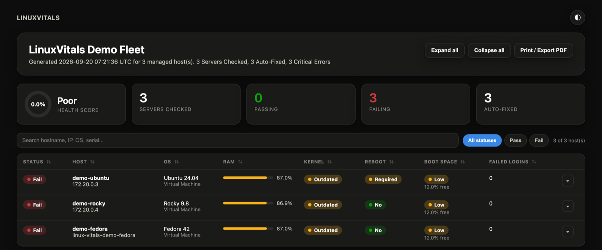

# Report Guide

LinuxVitals produces three artifacts per run: an HTML dashboard, a JSON
report, and (when baseline/postcheck snapshots exist) per-host JSON
snapshots. All three live under `reports/` next to your inventory.

## HTML dashboard

`reports/linux_vitals_report.html` -- self-contained (no external CSS/JS,
no CDN), works offline, opens in any browser.

[](images/dashboard-overview.png)

The screenshots on this page come from the [demo fleet](../demo/README.md) and
are regenerated by `demo/screenshots.sh`, so they track the current templates.

**Header.** Report title, generated timestamp, and -- for `baseline` /
`postcheck` runs -- a phase badge and the maintenance id, so you can tell
at a glance which run you're looking at.

**KPI row.** Servers checked, a health-score ring (pass-rate %, banded
Excellent ≥95% / Good ≥80% / Fair ≥60% / Poor <60%), passing/failing
counts, and auto-fixed count. On a `postcheck` run, three more tiles
appear: Improved, Regressed, New hosts (hosts with no matching baseline
snapshot).

**Toolbar.** A free-text search box (matches hostname, IP, OS, and serial
number), status filter chips (All / Pass / Fail), and -- on `postcheck`
runs -- comparison filter chips (All / Regressed / Improved / New). Expand
all / Collapse all buttons and a Print / Export PDF button (uses the
browser's native print dialog; "Save as PDF" there gives you an offline
copy).

**Host table.** One row per host, sortable by clicking any column header
(click again to reverse). Click the chevron (or the row) to expand an
inline detail panel with everything the summary row doesn't show:

- Identity (OS family, package manager, log source, virtualization type,
  serial number)
- Uptime and last reboot
- Kernel and bootloader validation (running vs. latest installed kernel,
  whether the default boot entry actually selects it)
- Security controls (SELinux/AppArmor status, failed login count and most
  recent attempt)
- Boot partition free space and rescue image availability
- Recent log errors and kernel/bootloader-related failures (with excerpts)
- Self-healing actions taken this run
- Findings -- the specific reasons a host failed, if any
- On `postcheck` runs with a baseline available: status/RAM/kernel/reboot
  before vs. after, plus new and resolved findings

[](images/dashboard-host-detail.png)

**Theme.** Follows your OS light/dark preference by default; the toggle in
the top-right corner overrides it (stored via `localStorage` where
available). The print stylesheet forces a light, borderless layout
regardless of theme.

**Scaling to hundreds of hosts.** The table renders every host's row and
detail panel up front (search/filter/sort are pure client-side DOM
operations, no server round-trip), which keeps the file self-contained at
the cost of a larger HTML file for very large fleets. Search and filtering
keep the working view small even when the underlying table is large. What the
*run* costs at that size, and how to measure it, is in
[performance.md](performance.md).

## JSON report

`reports/linux_vitals_report.json` -- schema `1.3`, intended for ingestion
by log shippers, SIEMs, or your own dashboards.

```json
{
  "schema_version": "1.3",
  "generated_at": "20260712T120000Z",
  "report": { "title": "...", "html_output_path": "...", "json_output_path": "..." },
  "maintenance": { "phase": "postcheck", "maintenance_id": "2026-07-12-patch-window" },
  "summary": {
    "overall_status": "PASS",
    "servers_checked": 5,
    "auto_fixed_count": 1,
    "critical_error_count": 1,
    "health_score_pct": 80.0,
    "health_score_band": "Good",
    "comparison_active": true,
    "regressed_count": 1,
    "improved_count": 1,
    "new_hosts_count": 2,
    "snippet": "5 Servers Checked, 1 Auto-Fixed, 1 Critical Error"
  },
  "hosts": [
    {
      "inventory_name": "web01",
      "hostname": "web01",
      "ip_address": "192.0.2.11",
      "status": "Pass",
      "os": { "distribution": "Ubuntu 24.04", "family": "Debian", "package_manager": "apt", "log_source": "journald" },
      "platform": { "type": "Virtual Machine", "virtualization_type": "kvm", "uptime": "12d 4h 21m", "last_reboot": "2026-06-30 08:15" },
      "kernel": { "running": "6.8.0-60-generic", "latest_installed": "6.8.0-60-generic", "latest_selected": true, "install_failures": 0, "install_failure_excerpt": [] },
      "bootloader": { "supported": true, "default_status": "resolved", "default_matches_latest": true, "validation_message": "Default boot entry selects the latest installed kernel" },
      "reboot": { "required": false, "detection_supported": true, "source": "reboot-required-file", "pending_packages": [], "reason": "No reboot required (reboot-required-file)" },
      "security": { "selinux_status": "not-installed", "apparmor_status": "enabled", "failed_login_count": 0, "last_failed_login": "No failed login attempts found" },
      "boot_space": { "mount": "/boot", "free_pct": 65.3, "status": "Healthy", "rescue_image_available": true, "rescue_image_paths": ["..."] },
      "memory": { "status": "OK", "used_pct": 42.5, "used_mb": 3480.0, "total_mb": 8192.0 },
      "logs": { "error_count": 0, "excerpt": [] },
      "self_healing": { "services_healed": ["chronyd.service"], "healing_results": [{ "service": "chronyd.service", "result": "Fixed" }] },
      "asset_serial": "VMware-56 4d 2a",
      "comparison": {
        "baseline_available": true,
        "status_before": "Fail",
        "status_after": "Pass",
        "status_improved": true,
        "status_regressed": false,
        "ram_used_pct_delta": -45.5,
        "kernel_changed": true,
        "new_findings": [],
        "resolved_findings": [
          {"id": "ram_critical", "message": "RAM usage is critical", "severity": "critical"}
        ],
        "severity_before": "critical",
        "severity_after": "none"
      },
      "severity": "none",
      "severity_counts": {"info": 0, "warning": 0, "critical": 0},
      "findings": []
    }
  ]
}
```

`comparison` is always present with at least `baseline_available`; on
`adhoc`/`baseline` runs, or for a host with no matching baseline snapshot,
it's `{"baseline_available": false}` and the rest of the comparison fields
are absent.

## Findings

What to *do* about each of these is in the [Operator Runbook](runbook.md).

Every finding is an object with a stable `id`, a human `message`, and a
`severity`:

```json
{"id": "reboot_required", "message": "System reboot is required", "severity": "warning"}
```

The `id` is the durable one. It is what severity is keyed on, what the
baseline/postcheck comparison diffs on, and what an external system should
join against -- `message` wording can change in any release without that
being a breaking change.

The self-healing finding additionally carries `subject`, the unit it refers
to, so a consumer does not have to parse the message to learn which service
needs attention.

### Severity

| Severity | Meaning |
| --- | --- |
| `critical` | Something is broken now, or you are blind to it |
| `warning` | Something will break, or a control you rely on is off |
| `info` | Worth seeing, too noisy to page on |

A host's `severity` is the highest severity among its findings, or `none`
when it has none. `severity_counts` breaks the same findings down by level,
and the report `summary` carries `hosts_by_severity` (each host counted once,
at its highest level, so the numbers partition the fleet) and
`findings_by_severity` (every finding counted).

### What each finding means, and how it is classified

| id | Severity | Fires when |
| --- | --- | --- |
| `ram_critical` | critical | RAM usage at or above `linux_vitals_ram_critical_threshold` |
| `journald_inactive` | critical | `systemd-journald` is not running -- the host's own logging is down |
| `service_manual_followup` | critical | A self-healing attempt did not end in `Fixed` |
| `sssd_inactive` | warning | `sssd` is not running |
| `time_sync_absent` | warning | No `chronyd`/`ntp` service is installed |
| `time_sync_inactive` | warning | The resolved time-sync service is not running |
| `reboot_required` | warning | Per-distro reboot detection fired -- see [kernel-reboot-detection.md](kernel-reboot-detection.md) |
| `kernel_not_latest` | warning | The running kernel is not the latest installed one |
| `bootloader_mismatch` | warning | The default boot entry does not select the latest installed kernel |
| `boot_space_low` | warning | Boot partition free space below `linux_vitals_boot_warning_threshold` |
| `kernel_install_failures` | warning | Kernel/bootloader failures in the audit log window |
| `selinux_disabled` | warning | SELinux disabled/unavailable on a RedHat-family host |
| `apparmor_disabled` | warning | AppArmor disabled/unavailable on a Debian-family host |
| `log_errors` | info | `journalctl` matched `error`/`failed` in the log window |
| `failed_logins` | info | Recent failed login attempts were detected |

Certificate findings, from the opt-in `vitals_certs` role. These are the one
group whose severity is computed rather than looked up, because it depends on
the certificate rather than on the finding type:

| id | Severity | Fires when |
| --- | --- | --- |
| `cert_expired` | critical | A certificate's `notAfter` is in the past |
| `cert_expiring` | critical / warning | Days remaining at or below `linux_vitals_cert_critical_days` / `..._warning_days` |
| `cert_weak_signature` | warning | The signature algorithm matches `linux_vitals_cert_weak_signature_algorithms` |
| `cert_self_signed` | warning | A **served** certificate is self-signed (self-signed files on disk are not flagged; CA roots are self-signed by definition) |
| `cert_weak_tls_version` | warning | An endpoint negotiated below `linux_vitals_cert_minimum_tls_version` |
| `cert_served_not_on_disk` | warning | The served certificate's fingerprint matches nothing on disk -- typically a service that was never reloaded after renewal |
| `cert_endpoint_unreachable` | warning | An endpoint could not be reached or did not complete a handshake |
| `cert_scan_unavailable` | info | No `openssl` binary on the host, so nothing could be parsed |

A host that ran `vitals_certs` also carries a `certificates` object
(`certificates_found`, `endpoints_checked`, `expired`, `soonest_expiry_days`,
`openssl_available`, `scanned_paths`). It is **omitted entirely** when the role
did not run, so a consumer can tell "no certificate scan" from "scanned, found
nothing".

`log_errors` and `failed_logins` are `info` because both occur on healthy
hosts as a matter of course; they are counts worth seeing, not events worth
paging on.

### Retuning severity, and what makes a host fail

Severity is a judgement about your estimate, so it is configurable. Override
individual findings rather than replacing the whole map -- a replaced map
means findings added in a later release have no entry and fall back to
`warning`:

```yaml
linux_vitals_finding_severity_overrides:
  apparmor_disabled: info       # we do not run AppArmor
  reboot_required: critical     # our change window is tight
```

`final_status` is `Fail` when a host has at least one finding at or above
`linux_vitals_fail_on_severity`:

```yaml
linux_vitals_fail_on_severity: warning
```

The default is `info`, which means **any** finding fails the host -- the
behaviour of every release before severity existed. Raising it is what turns
severity into triage: the host still reports every finding, and its
`severity` still reflects the worst of them, but only findings at or above
the threshold count against it. Because `final_status` drives the fleet
health score, raising the threshold raises the score.

An unrecognised value falls back to failing on anything, so a typo in
`group_vars` cannot silently pass a broken fleet.

## The Slack message

Sent as [Block Kit](https://api.slack.com/block-kit) whenever a Slack webhook
URL resolves. The shape, top to bottom:

| Part | Content |
| --- | --- |
| Colour bar | Green when everything passed, amber when the worst host severity is `warning`, red when there are critical errors or a critical-severity host |
| Header | `linux_vitals_slack_message_header` |
| Verdict | `PASS`/`FAIL` with an emoji, then the one-line snippet |
| Counters | Servers checked, auto-fixed, critical errors, health score -- laid out in two columns |
| Findings roll-up | Counts by severity, for findings and for hosts |
| Needs attention first | Up to 5 critical hosts, each with up to 3 of its critical findings |
| Per-host blocks | One block per host: status, uptime, kernel, bootloader, reboot, boot space, failed logins -- as labelled fields, not one `\|`-joined line |
| `+ N more` | Shown whenever the host cap applied |
| Footer | `linux_vitals_slack_message_footer`, if set |

The verdict word is derived exactly as the plain-text message and the generic
webhook derive it (`PASS` when `critical_error_count` is zero), so the three
can never disagree. Severity only chooses the colour.

**Ordering and the cap.** Hosts are sorted worst-first -- critical, warning,
info, then everything else -- and only the first `linux_vitals_slack_max_hosts`
(default 10) are rendered. The cap therefore drops the hosts with nothing
wrong. This is not cosmetic: Slack rejects a message over 50 blocks or 40,000
characters, and it rejects it with a bare HTTP 400 that names no cause, which
`no_log` then makes harder to diagnose. The cap is clamped to 30 at render
time regardless of what the variable is set to.

**Plain-text fallback.** The top-level `text` field still carries the old
plain-text message, because Slack uses it for the mobile push preview and for
accessibility clients -- a blocks-only message shows as blank in both. That
same text is what the email body and the generic webhook's `message` field
carry, unchanged.

## Generic webhook payload

Sent as a JSON POST body when `linux_vitals_generic_webhook_enabled: true`
and a URL resolves:

```json
{
  "summary": { "header": "...", "overall_status": "PASS", "servers_checked": 5, "auto_fixed_count": 1, "critical_error_count": 1, "snippet": "..." },
  "message": "<the same text sent to Slack>",
  "hosts": [
    { "hostname": "web01", "ip_address": "192.0.2.11", "status": "Pass", "platform_type": "Virtual Machine", "uptime": "12d 4h 21m", "running_kernel": "6.8.0-60-generic", "latest_kernel_selected": true, "reboot_required": false, "boot_space_status": "Healthy", "failed_login_count": 0, "findings": [] }
  ]
}
```

## Snapshots

`reports/snapshots/<maintenance_id>/<phase>/<hostname>.json` -- one file
per host per phase, written whenever `linux_vitals_phase` is `baseline` or
`postcheck`. Each file is exactly that host's `linux_vitals_result` object
at snapshot time (schema matches a single entry in the JSON report's
`hosts` array, minus the top-level `comparison` enrichment). These aren't
pruned automatically -- clean them up per your own retention policy if you
run many maintenance windows.
