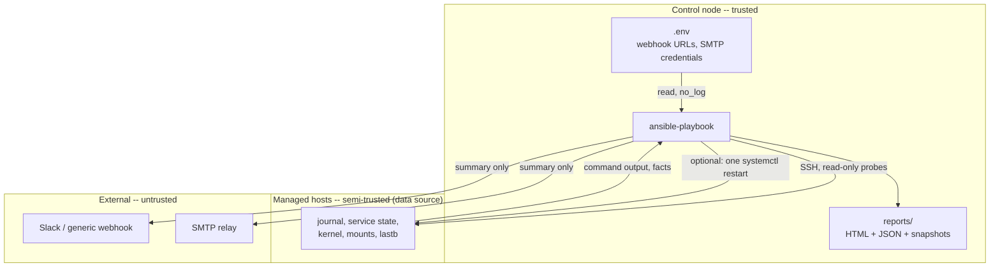

# Threat model

LinuxVitals reads privileged state from every host in a fleet, can restart
services on those hosts, writes a file containing the whole fleet's posture,
and posts a summary of it to a third party. Each of those is worth being
explicit about.

This document describes what the collection does, what it trusts, and where
the sharp edges are. It is the design-level companion to
[SECURITY.md](../.github/SECURITY.md), which covers how to *report* a problem. Claims
here are deliberately checkable against the code; file paths are given so you
can.

## Trust boundaries



The three boundaries that matter:

1. **Managed host → control node.** Everything a host returns is data the host
   controls. Some of it (journal lines, `lastb` output, hostnames) reaches the
   report verbatim.
2. **Control node → managed host.** Credentials never cross this boundary.
   Reports are rendered on the control node; managed hosts receive probe
   commands and, when self-healing is on, one `systemctl restart`.
3. **Control node → external.** Notification bodies leave your network. They
   carry a fleet summary, and -- depending on configuration -- hostnames.

## What we assume

- **The control node is trusted.** It holds `.env`, the SSH keys, and the
  reports. An attacker with control-node access has already won; nothing here
  defends against that.
- **Root on a managed host is trusted.** A host that is already fully
  compromised can lie to every probe. LinuxVitals reports what a host says
  about itself.
- **A *non-root* user on a managed host is not trusted.** This is the boundary
  that carries real weight: a low-privileged local user who can write to the
  journal, create a file under `/boot`, or provoke a failed login should not
  be able to turn that into code execution anywhere.

## `become` -- what actually needs it

**The collection never sets `become` itself.** There is no `become:` in any
role or shipped playbook; escalation is entirely the operator's decision, made
in inventory. That is deliberate: it means you choose the blast radius, and
`ansible-playbook --list-tasks` tells you the truth about what will run.

What degrades without escalation, rather than failing:

| Probe | Without `become` |
| --- | --- |
| `journalctl` | Only the invoking user's journal; error counts under-report |
| `lastb` | Fails; reported as unavailable, **not** as zero failed logins (see [#39](https://github.com/sameeralam3127/linux-vitals/issues/39)) |
| `needs-restarting`, `zypper needs-rebooting` | Usually fails; falls back to kernel comparison |
| `getenforce`, `aa-status` | Usually readable unprivileged |
| Bootloader default entry | `grubby`/`grub2-editenv` typically needs root |
| `service_facts` | Unit list is readable; some states are not |

**Recommendation:** grant `become` narrowly. The scan needs to *read*
privileged state, not to write anything. A sudoers rule limited to the probe
commands is enough for everything except self-healing, and is meaningfully
safer than blanket `NOPASSWD: ALL`:

```sudoers
automation ALL=(root) NOPASSWD: /usr/bin/journalctl, /usr/bin/lastb, \
    /usr/bin/needs-restarting, /usr/sbin/getenforce, /usr/sbin/aa-status, \
    /usr/sbin/grubby, /usr/bin/who
```

Add `/usr/bin/systemctl restart *` only on hosts where you intend to enable
self-healing -- and note that `systemctl` in sudoers is close to a root grant,
since it can start any unit. If that matters to you, keep self-healing off and
treat LinuxVitals as read-only.

## Command injection

**No task uses the `shell` module.** All 13 command tasks in `vitals_scan` use
`ansible.builtin.command` with `argv:` lists, so arguments are passed to
`execve` without a shell parsing them.

Five probes do run `sh -c` with an inline script -- kernel enumeration,
bootloader inspection, and the three per-family reboot checks. **None of those
scripts interpolate a Jinja variable.** They are static text; the only
templated value anywhere near a command is `linux_vitals_log_window`, which is
a separate `argv` element passed to `journalctl --since` and never reaches a
shell.

That is the property to preserve, and the one most likely to be broken by a
well-meaning change. **If you add a probe, put host data in its own `argv`
element. Never build a command string.** A `sh -c` script with a `{{ }}` in it
is a command-injection bug, because the values available at that point --
hostnames, mount paths, kernel strings, unit names -- are all attacker-
influenceable on a compromised host.

## Self-healing: what it can and cannot modify

`vitals_heal` is the only component that writes to a managed host. Its
contract, from [roles/vitals_heal/tasks/main.yml](../roles/vitals_heal/tasks/main.yml):

**It can:** issue exactly one `service: state=restarted` per unit that is both
(a) reported by `service_facts` as `failed`, and (b) answers `enabled` to
`systemctl is-enabled`.

**It cannot:**

- run at all unless `linux_vitals_heal_enabled: true` -- the default is `false`
- start a unit that is stopped but not failed
- start a `disabled`, `static`, `indirect`, or `masked` unit -- the check reads
  `is-enabled` **stdout**, not its exit code, because `is-enabled` answers
  those with rc 0
- retry: one restart per unit, per run
- stop, mask, disable, reconfigure, or install anything
- touch files, packages, users, or the network
- reboot a host -- reboot-required is reported, never acted on

**The residual risk is the enable bit.** Self-healing restarts whatever is
enabled and failed. A local user who can get a unit into a failed state, on a
host where they can also influence what that unit executes, gets a root-context
restart of it at your next run. That is a compromised host either way, but it
is the mechanism by which LinuxVitals could become part of a chain. Two
consequences worth accepting deliberately:

- **Enable self-healing per group, not globally.** It is a per-host decision
  about how much you trust that host's unit files.
- **There is no allowlist of healable services.** If you need one, do not
  enable the role; run it against a group you have scoped instead. (Making the
  required-service list configurable is tracked as
  [#32](https://github.com/sameeralam3127/linux-vitals/issues/32).)

Also note the known race in [#24](https://github.com/sameeralam3127/linux-vitals/issues/24):
`service_facts` can be read before a restarted unit has settled, so a service
that died again immediately may be reported `Fixed`. That is a correctness bug
with a trust consequence -- the report can assert a remediation that did not
hold.

## `vitals_certs`: the only role that opens a connection

`vitals_certs` is opt-in (`linux_vitals_certs_enabled: false` by default) and
is worth its own note, because it does two things no other part of the
collection does.

**It makes outbound network connections.** With
`linux_vitals_cert_endpoints` set, each managed host opens a TLS connection to
each configured endpoint. Consequences to accept deliberately:

- **Connections originate on the managed host, not the control node.** A
  host:port you configure is reached from every host in the play, so a fleet of
  200 hosts checking one endpoint makes 200 connections to it. Point endpoints
  at `localhost` to check what that host itself serves, which is the intended
  use; anything else is a fan-out you are choosing.
- **The endpoint list is not a scanner and must not become one.** It is an
  explicit list, empty by default. Enabling the role connects to nothing until
  you name a target.
- **Certificate verification is deliberately disabled** during the handshake.
  The job is to report what is being served, including a certificate that is
  expired, self-signed, or for the wrong name -- verifying would turn exactly
  the cases worth reporting into a handshake failure with no detail. Nothing
  is sent over the connection and no data is exchanged beyond the handshake:
  the socket is closed as soon as the peer certificate is read. **This is a
  reporting tool, not a trust decision.** Never use its output as evidence
  that a certificate chain validates.

**It reads directories that hold private keys.** The default
`linux_vitals_cert_fs_paths` include `/etc/letsencrypt/live` and
`/etc/nginx/ssl`, which contain private keys alongside certificates, and
reading them needs `become` on most hosts. Two properties bound this:

- **Only the first PEM `CERTIFICATE` block of a file is read.** A file holding
  no certificate -- a `privkey.pem` -- is skipped entirely, and its contents
  never enter a variable, a fact, or a report.
- **No private key material is ever parsed, stored, or reported.** The fields
  that reach the report are subject, issuer, validity dates, signature
  algorithm, and a SHA-256 fingerprint of the *certificate*. Certificates are
  public by design; the fingerprint is not a secret.

Still, granting `become` so the role can read a key directory is a real
escalation of what the automation account can reach. If that is not acceptable,
set `linux_vitals_cert_fs_paths` to the public certificate paths only, or run
the role against endpoints alone.

**What lands in the report.** Certificate findings name the **path** of each
certificate and the **host:port** of each endpoint, so a report now also
describes where TLS terminates in your estate and which certificates are
closest to expiry. That is useful to an attacker for the same reason it is
useful to you. It is covered by the same handling as the rest of the report --
see below.

## Credentials

Four secrets exist: a Slack webhook URL, a generic webhook URL, any headers
configured for it, and SMTP username/password.

**An incoming webhook URL is a bearer token.** Anyone holding it can post to
that channel. It is a credential, not an address, and is treated as one
throughout.

How they are handled:

- Loaded from `.env` next to your inventory, or from inventory/`group_vars`/
  extra vars. Explicit variables win; `.env` is the fallback; an unset channel
  is skipped.
- Every task that reads or resolves them is `no_log: true` --
  [config.yml](../roles/vitals_report/tasks/config.yml) has it on all three
  tasks, and every send task in
  [notify.yml](../roles/vitals_report/tasks/notify.yml) has it too.
- `no_log` on the *sends* is the load-bearing one. Ansible prints a failing
  task's arguments; without it, one failed POST would publish the webhook URL
  to CI logs, terminal scrollback, and every callback plugin.
- Failures are therefore reported by a separate task that quotes only the
  channel and the HTTP status. The module's own `msg` is never echoed, because
  for some failure modes it embeds the URL.
- Credentials never reach a managed host, a report file, or a notification
  body.

**What this does not cover.** `.env` is plain text on the control node, at
whatever mode you created it with -- `chmod 600` it. `.env` and `.envrc` are
gitignored, but a `.env` you place beside an inventory in *another* repo is
that repo's problem. If you need secrets at rest encrypted, use
`ansible-vault` and set the variables directly rather than through `.env`; the
precedence rules already prefer them.

## What ends up in a report

This is the most under-appreciated risk in the project, because the output
looks like a dashboard rather than like data.

A generated report contains, for every host:

- **Identity and inventory:** hostname, IP address, hardware serial
  (`asset_serial`), virtualization type, uptime, last reboot
- **Patch posture:** running kernel, latest installed kernel, bootloader
  default, whether a reboot is pending and which packages want it
- **Security posture:** SELinux mode, AppArmor status, failed-login count, and
  **the last failed login line** -- which carries a username and a source IP
- **Raw journal excerpts:** `log_excerpt` and `kernel_install_failure_excerpt`
  are journal lines copied verbatim. Journals contain whatever applications
  log to them, which in practice means tokens, connection strings, email
  addresses, and internal hostnames

Taken together that is **a fleet inventory cross-referenced with an unpatched-
kernel list** -- a target map. Treat a LinuxVitals report as sensitive at the
level of the hosts it describes.

Concretely:

- **Reports are world-readable by default.** `render.yml` and `snapshot.yml`
  create files with `linux_vitals_report_file_mode` (`0644`) and directories
  with `linux_vitals_report_dir_mode` (`0755`). On a shared control node other
  local users may be able to read them. Set both to `"0600"` and `"0700"`
  respectively to restrict access to the automation user, and keep the output
  in a suitably protected location:
  ```yaml
  linux_vitals_output_path: "/var/lib/linux-vitals/report.html"
  linux_vitals_report_file_mode: "0600"
  linux_vitals_report_dir_mode: "0700"
  ```
- **Do not commit reports.** `reports` is gitignored here; the same directory
  beside an inventory in another repo is not automatically.
- **Archive retention keeps history.** With
  `linux_vitals_report_retention_count: 10` you are holding ten fleet
  snapshots. Include them in whatever retention and disposal policy covers the
  hosts themselves.
- **Snapshots persist longer than reports.** Baseline/postcheck snapshots under
  `linux_vitals_snapshot_dir` are not pruned by the archive retention count.
  Delete maintenance-id directories when the window closes.

### The dashboard as an artifact

The HTML dashboard renders host-controlled strings, so it is an XSS target by
construction. Two properties keep it safe, both worth preserving:

- **No host data reaches JavaScript.** The template's `<script>` block contains
  no Jinja expression at all -- it is static code that reads the DOM. Host
  values exist only as escaped text nodes and attributes.
- **The report is self-contained.** No CDN links, no external requests, no
  remote fonts. Opening a report cannot phone home, and cannot leak the fleet
  posture to a third party by loading a resource.

A change that interpolates a host value into that `<script>` block -- or that
adds an external asset -- breaks a stated security property and should be
treated as a vulnerability, not a feature.

## What leaves your network

Only notification bodies. They contain the run summary -- counts, health
score, overall status -- and, when
`linux_vitals_slack_include_host_breakdown` is `true` (the default), a
per-host breakdown including hostnames and statuses.

If your hostnames are themselves sensitive, set it to `false`. The report
itself is never attached or uploaded to any channel.

For the generic webhook, `linux_vitals_generic_webhook_headers` is the
documented place for an `Authorization` header; it is covered by the same
`no_log` as the URL. Prefer a webhook endpoint you control over a third-party
relay, since the payload describes your fleet.

## SSH

Transport security is Ansible's and OpenSSH's, not this collection's -- but
the account you point it at is your decision, and it is the widest-reaching
one:

- **One key, one purpose.** A dedicated automation key, not an operator's
  personal key.
- **Constrain it.** `from=`, `restrict`, and a `command=` forced command where
  your environment supports it.
- **Prefer a bastion over a flat mesh.** The control node needs to reach every
  host in the fleet; that reachability is the real attack surface, and it
  outlives any single run.
- **Know what the shipped host-key policy actually is.** `ansible.cfg` sets
  `host_key_checking = True`, but its `ssh_args` also set
  `StrictHostKeyChecking=accept-new`. That is trust-on-first-use: a host not
  yet in `known_hosts` is accepted and pinned, and only a *changed* key is
  refused. It is a convenience for onboarding a fleet, and it means the first
  connection to any host is unauthenticated. If you provision `known_hosts`
  out of band -- and for a fleet whose posture you are about to read, you
  should -- override it to `StrictHostKeyChecking=yes`. That config is for
  developing this collection; your project's `ansible.cfg` is the one that
  governs your runs.

## Out of scope

Stated here to match [SECURITY.md](../.github/SECURITY.md):

- A compromised control node, or an already-root attacker on a managed host.
- Wrong or noisy findings. Those are ordinary bugs; open a normal issue.
- Vulnerabilities in Ansible Core, `community.general`, or distribution
  tooling -- report those upstream.
- The harnesses under [molecule/](../molecule/) and [demo/](../demo/), which
  run privileged containers on purpose and ship in neither the published
  collection nor any production path.

## If you find something

Do not open a public issue. Use
[private vulnerability reporting](https://github.com/sameeralam3127/linux-vitals/security/advisories/new),
or the email address in [SECURITY.md](../.github/SECURITY.md). Response targets are
documented there.
